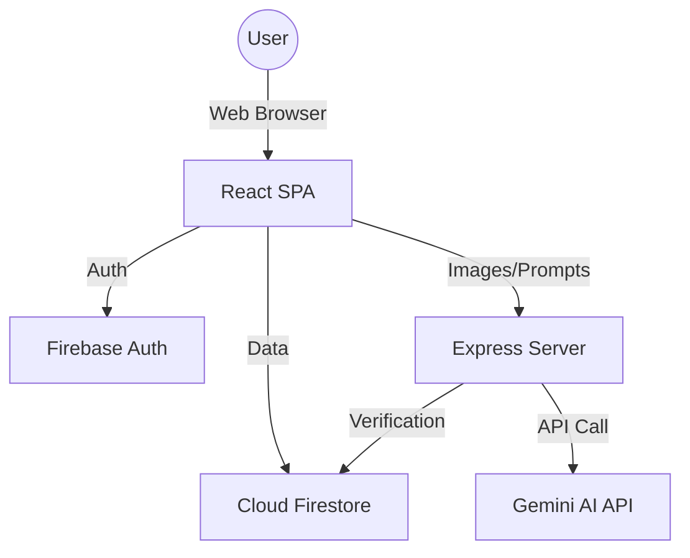
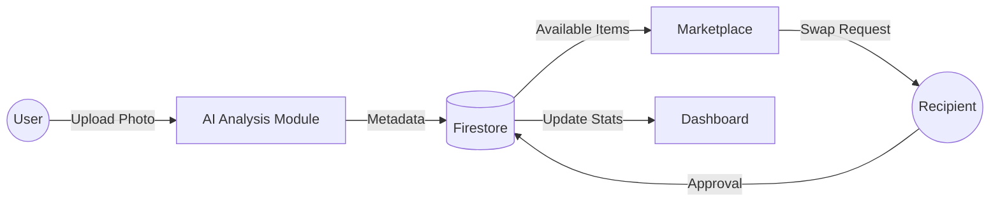

# Project Report: Waste Swap Network

## 1. INTRODUCTION
**Waste Swap Network** is a cutting-edge digital platform designed to transform urban waste management into a vibrant circular economy. Specifically tailored for metropolitan areas like Chennai, the platform empowers citizens to treat their "trash" as a valuable resource. By leveraging Artificial Intelligence and Peer-to-Peer (P2P) networking, the application facilitates the seamless exchange, sale, and reuse of materials that would otherwise contribute to environmental degradation.

## 2. ABSTRACT
This project implements a decentralized waste management ecosystem. At its core, it utilizes **Multimodal AI (Google Gemini API)** to automate waste classification, estimate weight, and assess the repairability of items from simple photographs. The platform features a location-aware marketplace where users can swap items or conduct transactions via integrated UPI flows. A gamified dashboard tracks environmental contributions, such as CO2 emissions saved, while a bilingual AI Eco Assistant provides real-time guidance. The system is built using a modern stack including **React, Firebase, and Tailwind CSS**, ensuring high performance and scalability.

## 3. PROBLEM STATEMENT
Traditional waste management in cities like Chennai suffers from several critical flaws:
*   **Lack of Segregation**: Waste is often mixed at the source, making recycling difficult and expensive.
*   **Information Gap**: Individuals possess reusable items but lack a convenient way to find someone who needs them.
*   **Economic Disincentive**: The effort required to sell small quantities of recyclables often outweighs the perceived financial gain.
*   **Environmental Blindness**: Citizens are disconnected from the direct environmental impact of their disposal habits.

## 4. REVIEW OF THE LITERATURE
The transition from a linear "take-make-dispose" model to a **Circular Economy** is recognized globally as a key strategy for sustainability. Literature suggests that P2P platforms significantly reduce "transaction costs" for recycling. Furthermore, the integration of AI in waste management (Computer Vision for sorting) has shown to increase the purity of recycled streams. Platforms that combine social networking with environmental goals (Social-Environmental Networks) have higher user retention rates than purely functional utility apps.

## 5. EXISTING SYSTEM WITH DISADVANTAGES
The current system relies heavily on informal scrap dealers (Kabadiwalas) and municipal collection.
### Disadvantages:
*   **Inconsistency**: Pricing for waste varies wildly and is often non-transparent.
*   **Limited Reach**: Users are restricted to the dealers who physically visit their street.
*   **Manual Effort**: No automated way to identify or value waste; everything depends on human judgment.
*   **No Impact Tracking**: Users have no record of how much they have contributed to the environment over time.

## 6. PROPOSED SYSTEM
The proposed Waste Swap Network introduces a technology-first approach:
*   **AI Segregation**: Users simply snap a photo; the AI identifies the material (plastic, metal, etc.) and its condition.
*   **Smart Valuation**: AI-driven weight and value estimation provide a fair baseline for swaps.
*   **P2P Marketplace**: A "Tinder-like" or "OLX-like" interface for waste, allowing users to browse items near them.
*   **Bilingual Eco Assistant**: A voice-enabled chatbot that speaks English and Tamil to assist non-technical users.
*   **Environmental Ledger**: Every swap is converted into "CO2 saved" metrics, displayed on a personal dashboard.

## 7. SOCIETY AND ENVIRONMENTAL RELEVANCE (SDG DETAILS)
The project aligns with the United Nations Sustainable Development Goals:
*   **SDG 11 (Sustainable Cities)**: By reducing landfill pressure and promoting local resource efficiency.
*   **SDG 12 (Responsible Consumption)**: By extending the lifecycle of products through reuse and repair.
*   **SDG 13 (Climate Action)**: By directly reducing the carbon footprint associated with manufacturing new products from virgin materials.

## 8. H/W & S/W REQUIREMENTS
### Software Requirements:
*   **Frontend**: React 18, TypeScript, Tailwind CSS, Framer Motion.
*   **Backend/Database**: Firebase Firestore, Firebase Auth, Node.js (Express).
*   **AI Engine**: Google Gemini 1.5 Pro/Flash (Multimodal).
*   **APIs**: Axios for HTTP requests, Lucide-React for iconography.

### Hardware Requirements:
*   **Client**: Any smartphone or laptop with a camera and modern web browser.
*   **Server**: Cloud-hosted environment (Google Cloud Run/Vercel).

## 9. ARCHITECTURE DIAGRAM, DATA FLOW DIAGRAM & UML DIAGRAM

### System Architecture


### Data Flow Diagram (Level 1)


### UML Use Case Diagram
```mermaid
useCaseDiagram
    actor User
    actor Admin
    
    User --> (Upload Waste)
    User --> (Search Swaps)
    User --> (Chat with Owner)
    User --> (Track Impact)
    
    Admin --> (Monitor Analytics)
    Admin --> (Manage Users)
    Admin --> (Verify Transactions)
```

## 10. MODULES EXPLANATION
1.  **Authentication Module**: Handles secure onboarding via Google OAuth. It initializes user profiles and "Eco Score" tracking.
2.  **AI Vision Module**: The "brain" of the app. It processes images to detect waste type, weight, and repairability. It also generates eco-tips for each item.
3.  **Marketplace Module**: A location-aware engine that filters items based on proximity to the user. Includes advanced search and category filtering.
4.  **Transaction & Chat Module**: Facilitates P2P communication. It manages the lifecycle of a "Swap Request" from pending to completed, including UPI payment verification.
5.  **Eco-Dashboard Module**: Visualizes complex environmental data into easy-to-understand charts (CO2 saved, trees equivalent, etc.).
6.  **Admin Command Center**: A high-level dashboard for platform moderators to view system-wide impact and manage the community.
